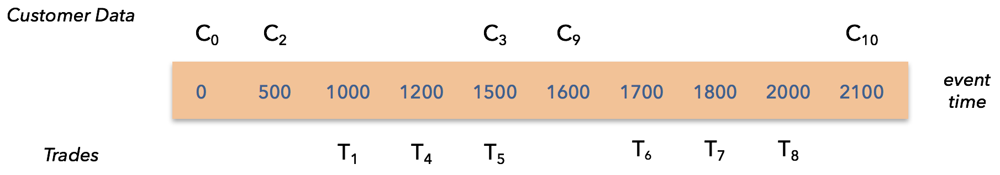

The objective of this exercise is to join a stream of customer info elements to a stream of financial trades.

The `Customer` records contain:

~~~
timestamp      : long    // timestamp (milliseconds since the epoch)
customerId     : long    // a unique id for each event
customerInfo   : String  // payload to join to trades
~~~

The `Trade` records contain:

~~~
timestamp      : long    // timestamp (milliseconds since the epoch)
customerId     : long    // a unique id for each event
tradeInfo      : String  // payload
~~~

The result of the join is an `EnrichedTade`:

~~~
trade          : Trade
customerInfo   : String
~~~

You will find these basic types here:

- [Customer.java](https://github.com/dataArtisans/flink-training-exercises/blob/master/src/main/java/com/dataartisans/flinktraining/exercises/datastream_java/datatypes/Customer.java)
- [Trade.java](https://github.com/dataArtisans/flink-training-exercises/blob/master/src/main/java/com/dataartisans/flinktraining/exercises/datastream_java/datatypes/Trade.java)
- [EnrichedTrade.java](https://github.com/dataArtisans/flink-training-exercises/blob/master/src/main/java/com/dataartisans/flinktraining/exercises/datastream_java/datatypes/EnrichedTrade.java)

Here's what's involved in doing a "low-latency, event time join":

1. When receiving a trade it should be immediately joined with the customer data, however
to keep this 100% deterministic, join against the latest customer data that
has a timestamp LESS THAN the trade timestamp -- not simply the latest available data.
In other words, join against the customer data that was known at the time of the trade.

2. Also set a trigger to evaluate the trade again once the watermark has passed the trade
time. Basically, use event time to ensure that you have
"complete" data, and then join again at that time. This will produce a deterministic
result even in the face of undordered data, etc.
This approach has the benefit that you don't introduce any latency into the trade stream,
because you always join right away.  You then emit a BETTER result if you receive better
information. Use event time in order to know how long to wait for this potential
better information.

3. It's also important to eventually expire state. Again it's appropriate to use an event
time timer for this.

These two figures show how the dataset is organized. First we show when the `Customer` and `Trade` stream elements
arrive. For example, the first `Customer` record has a event time timestamp of 0, and arrives at
processing time 0; the first `Trade` arrives after one second of processing time, and has an event time timestmap
of 1000:

This second figure shows the same information, but is now organized by event time:

Take a few minutes now, before reading the code below, and see if you can write down which customer info should be joined
which each of the trades as they arrive, and in what cases an updated join should be emitted later.

We've provided most of the code for you. Here's the application, which you can find at:

- Java: [LowLatencyEventTimeJoin.java](https://github.com/dataArtisans/flink-training-exercises/blob/master/src/main/java/com/dataartisans/flinktraining/exercises/datastream_java/process/LowLatencyEventTimeJoin.java)
- Scala: [LowLatencyEventTimeJoin.scala](https://github.com/dataArtisans/flink-training-exercises/blob/master/src/main/scala/com/dataartisans/flinktraining/exercises/datastream_scala/lowlatencyjoin/LowLatencyEventTimeJoin.scala)

#### Java


import com.dataartisans.flinktraining.exercises.datastream_java.datatypes.Customer;
import com.dataartisans.flinktraining.exercises.datastream_java.datatypes.EnrichedTrade;
import com.dataartisans.flinktraining.exercises.datastream_java.datatypes.Trade;
import com.dataartisans.flinktraining.exercises.datastream_java.sources.FinSources;
import org.apache.flink.streaming.api.TimeCharacteristic;
import org.apache.flink.streaming.api.datastream.DataStream;
import org.apache.flink.streaming.api.environment.StreamExecutionEnvironment;

public class LowLatencyEventTimeJoin {
  public static void main(String[] args) throws Exception {
    // set up streaming execution environment
    StreamExecutionEnvironment env =
      StreamExecutionEnvironment.getExecutionEnvironment();
    env.setStreamTimeCharacteristic(TimeCharacteristic.EventTime);

    // simulated trade stream
    DataStream<Trade> tradeStream = FinSources.tradeSource(env);

    // simulated customer stream
    DataStream<Customer> customerStream = FinSources.customerSource(env);

    DataStream<EnrichedTrade> joinedStream = tradeStream
        .keyBy("customerId")
        .connect(customerStream.keyBy("customerId"))
        .process(new EventTimeJoinFunction());

    joinedStream.print();

    env.execute("Low-latency event-time join");
  }
}


#### Scala


import com.dataartisans.flinktraining.exercises.datastream_scala.sources.FinSources
import org.apache.flink.api.scala._
import org.apache.flink.streaming.api.TimeCharacteristic
import org.apache.flink.streaming.api.scala.StreamExecutionEnvironment

object LowLatencyEventTimeJoin {
  def main(args: Array[String]) {
    val env = StreamExecutionEnvironment.getExecutionEnvironment
    env.setStreamTimeCharacteristic(TimeCharacteristic.EventTime)

    // simulated trade stream
    val tradeStream = FinSources.tradeSource(env)

    // simulated customer stream
    val customerStream = FinSources.customerSource(env)

    val joinedStream = tradeStream
      .keyBy(_.customerId)
      .connect(customerStream.keyBy(_.customerId))
      .process(new EventTimeJoinFunction)

    joinedStream.print()

    env.execute
  }
}


You task is to complete the implementation of the `EventTimeJoinFunction`. All you need to do is
replace each occurance of ??? with something appropriate.

#### Java


import com.dataartisans.flinktraining.exercises.datastream_java.datatypes.Customer;
import com.dataartisans.flinktraining.exercises.datastream_java.datatypes.EnrichedTrade;
import com.dataartisans.flinktraining.exercises.datastream_java.datatypes.Trade;
import com.dataartisans.flinktraining.exercises.datastream_scala.lowlatencyjoin.EventTimeJoinHelper;
import org.apache.flink.streaming.api.TimerService;
import org.apache.flink.util.Collector;
import scala.collection.Iterator;

public class EventTimeJoinFunction extends EventTimeJoinHelper {
  @Override
  public void processElement1(Trade trade,
  	                      Context context,
			      Collector<EnrichedTrade> collector) {
    System.out.println("Received " + trade.toString());
    TimerService timerService = context.timerService();
    EnrichedTrade joinedData = join(trade);
    collector.collect(joinedData);

    if (context.timestamp() ??? timerService.currentWatermark()) {
      enqueueEnrichedTrade(joinedData);
      timerService.registerEventTimeTimer(trade.timestamp);
    } else {
      // Handle late data -- detect and join against what, latest?  Drop it?
    }
  }

  @Override
  public void processElement2(Customer customer,
                              Context context,
			      Collector<EnrichedTrade> collector) {
    System.out.println("Received " + customer.toString());
    enqueueCustomer(customer);
  }

  @Override
  public void onTimer(long l,
                      OnTimerContext context,
		      Collector<EnrichedTrade> collector) {
    // look for trades that can now be completed
    Long watermark = context.timerService().currentWatermark();
    while (timestampOfFirstTrade() ??? watermark) {
      // do the join and remove from the tradebuffer
      dequeueAndPerhapsEmit(collector);
    }

    // Cleanup all the customer data that is eligible
    cleanupEligibleCustomerData(watermark);
  }

  private EnrichedTrade join(Trade trade) {
    return new EnrichedTrade(trade, getCustomerInfo(trade));
  }

  private String getCustomerInfo(Trade trade) {
    Iterator<Customer> it = customerIterator();
    while (it.hasNext()) {
      Customer customer = it.next();

      if (customer.timestamp ??? trade.timestamp) {
        return customer.customerInfo;
      }
    }
    return "No customer info available";
  }

  private void dequeueAndPerhapsEmit(Collector<EnrichedTrade> collector) {
    EnrichedTrade enrichedTrade = dequeueEnrichedTrade();

    EnrichedTrade joinedData = join(enrichedTrade.trade);
    // Only emit again if we have better data
    if (!joinedData.equals(enrichedTrade)) {
      collector.collect(joinedData);
    }
  }
}


#### Scala


import org.apache.flink.api.scala._
import com.dataartisans.flinktraining.exercises.datastream_java.datatypes.{Customer, EnrichedTrade, Trade}
import org.apache.flink.streaming.api.functions.co.CoProcessFunction.{Context, OnTimerContext}
import org.apache.flink.util.Collector

class EventTimeJoinFunction extends EventTimeJoinHelper {

  override def processElement1(trade: Trade,
                               context: Context,
			       collector: Collector[EnrichedTrade]): Unit = {
    println(s"Received: $trade")

    val timerService = context.timerService()
    val joinedData = join(trade)
    collector.collect(joinedData)
    if (context.timestamp() ??? timerService.currentWatermark()) {
      enqueueEnrichedTrade(joinedData)
      timerService.registerEventTimeTimer(trade.timestamp)
    } else {
      // Handle late data -- detect and join against what, latest?  Drop it?
    }
  }

  override def processElement2(customer: Customer,
                               context: Context,
			       collector: Collector[EnrichedTrade]): Unit = {
    println(s"Received $customer")
    enqueueCustomer(customer)
  }

  override def onTimer(l: Long,
                       context: OnTimerContext,
		       collector: Collector[EnrichedTrade]): Unit = {
    // look for trades that can now be completed
    val watermark: Long = context.timerService().currentWatermark()
    while (timestampOfFirstTrade() ??? watermark) {
      // do the join and remove from the tradebuffer
      dequeueAndPerhapsEmit(collector)
    }

    // Cleanup all the customer data that is eligible
    cleanupEligibleCustomerData(watermark)
  }

  private def join(trade: Trade): EnrichedTrade = {
    // get the customer info that was in effect at the time of this trade
    // doing this rather than jumping straight to the latest known info makes
    // this 100% deterministic.  If that's not a strict requirement we can simplify
    // this by joining against the latest available data right now.
    new EnrichedTrade(trade, getCustomerInfo(trade))
  }

  private def getCustomerInfo(trade: Trade): String = {
    customerBufferState.value()
      .filter(_.timestamp ??? trade.timestamp)
      .headOption
      .map(_.customerInfo)
      .getOrElse("No customer info available")
  }

  protected def dequeueAndPerhapsEmit(collector: Collector[EnrichedTrade]): Unit = {
    val enrichedTrade = dequeueEnrichedTrade()

    val joinedData = join(enrichedTrade.trade)
    // Only emit again if we have better data
    if (!joinedData.equals(enrichedTrade)) {
      collector.collect(joinedData)
    }
  }
}


You may find it helpful and/or interesting to also look at the implementation of [EventTimeJoinHelper.scala](https://github.com/dataArtisans/flink-training-exercises/blob/master/src/main/scala/com/dataartisans/flinktraining/exercises/datastream_scala/lowlatencyjoin/EventTimeJoinHelper.scala).

Your results should look like this:

~~~
Received Customer(0) Customer data @ 0
Received: Trade(1000) trade-1
3> EnrichedTrade(1000) Customer data @ 0
Received Customer(500) Customer data @ 500
Received Customer(1500) Customer data @ 1500
3> EnrichedTrade(1000) Customer data @ 500
Received: Trade(1200) trade-2
3> EnrichedTrade(1200) Customer data @ 500
3> EnrichedTrade(1200) Customer data @ 500
Received: Trade(1500) trade-3
3> EnrichedTrade(1500) Customer data @ 1500
3> EnrichedTrade(1500) Customer data @ 1500
Received: Trade(1700) trade-4
3> EnrichedTrade(1700) Customer data @ 1500
Received: Trade(1800) trade-5
3> EnrichedTrade(1800) Customer data @ 1500
Received: Trade(2000) trade-6
3> EnrichedTrade(2000) Customer data @ 1500
Received Customer(1600) Customer data @ 1600
Received Customer(2100) Customer data @ 2100
3> EnrichedTrade(2000) Customer data @ 1600
3> EnrichedTrade(1800) Customer data @ 1600
3> EnrichedTrade(1700) Customer data @ 1600
~~~

